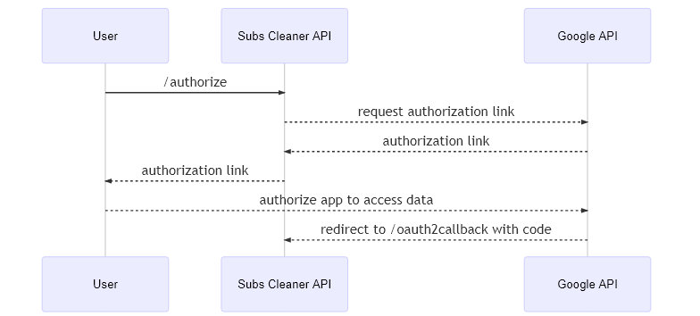

# Subs Cleaner API

This is the repository of the upcoming web application called **Subs Cleaner**. Its main goal is to communicate with the Youtube API in order to get user's subscriptions and delete them.
# API docs

In order to use this API you will need to first authorize it to access your youtube account through the **/authorize** endpoint. Then you call the only availible ressource for the moment which is **/subscription** . More details are provided in the **Flow** section below.
# Goal of This API

Provide a **faster** and **easier** way to delete subscriptions through the web application.
(link coming soon).

## Flow
This diagram shows how the API gets the authorization to access user's data.
